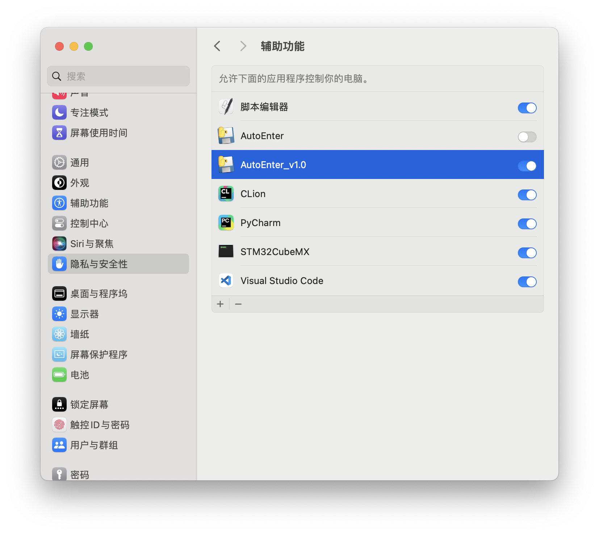
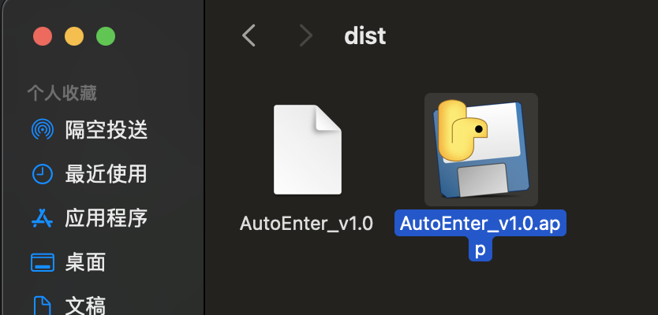
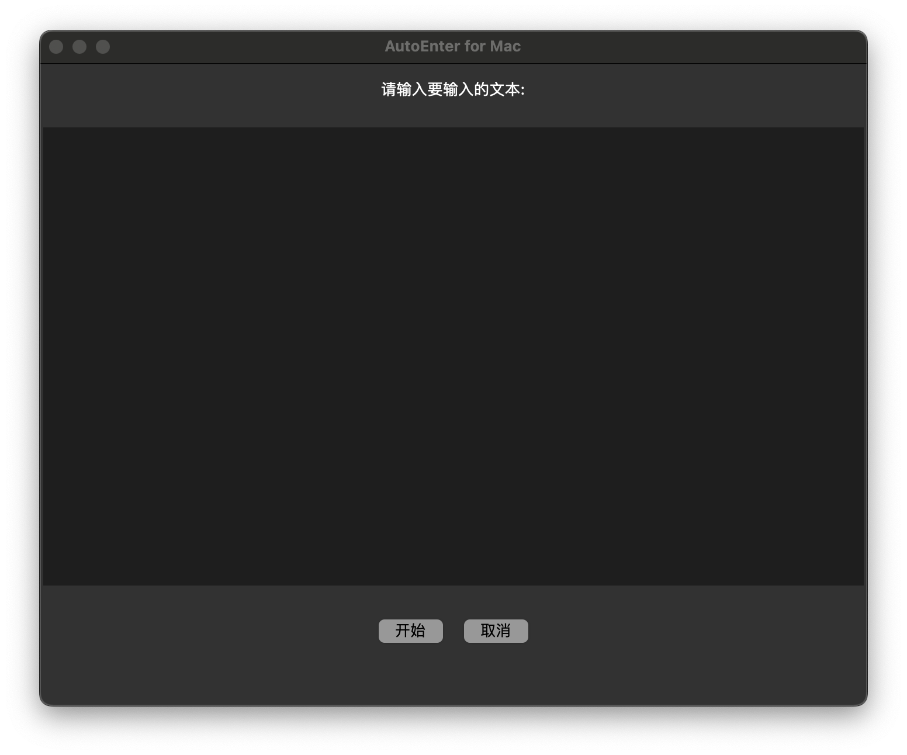
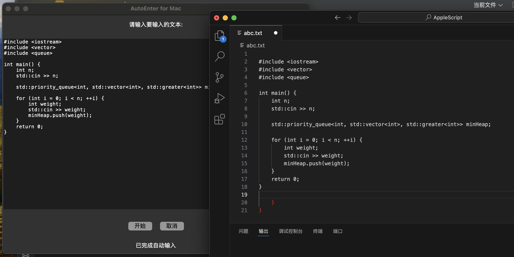

# 项目名称  
一个基于 Tkinter 和 PyAutoGUI 的自动输入脚本  

## 功能  
自动输入文本  

## 使用说明  
1. dist文件夹里面有个AutoEnter_v1.0.app，使用前请打开设置，**隐私与安全性->辅助功能**，将AutoEnter_v1.0.app加入,**加入后点开可直接使用**


2. 打开AutoEnter_v1.0.app后，在文本框中输入你想要自动输入的文字

3. 输入完成后点击开始，等待3s后会自动开始打印，在等待的过程中你需要选中你要输入文本的地方

4. 等待输入完成即可  

## 注意
1. 选中要输入的地方后不要在点击其他的可以输入文字的地方，**这样做可能会导致一半输入在A文本框，另一半输入在B文本框**
2. 目前只支持输入**英文**
3. 使用前记得**切换为英文**输入法
4. 原理是模拟键盘输入，可以用在一些不能复制粘贴的地方
5. 脚本文件为**AutoEnter_v1.0.py**，可以自行根据需求调整

## 安装&&使用  
### 1. 克隆仓库
```angular2html
git clone https://github.com/Abbykawaii/AutoEnter-for-Mac.git
```
### 2. 进入项目文件夹
```angular2html
cd yourproject
```
### 3. 安装依赖项
确保已安装 Python 3.x 和 pip，然后执行以下命令：
```angular2html
pip install pyautogui
# python 3.x自带Tkinter，如果Tkinter缺失输入如下命令（请确保你下载了HomeBrew）：
brew install python-tk
```
### 4. 使用
```angular2html
python AutoEnter_v1.0.py
```
## 贡献  
欢迎贡献代码！请先 Fork 本仓库，然后创建您的分支，完成后提交 Pull Request。
```angular2html
# 克隆项目到本地
git clone https://github.com/Abbykawaii/AutoEnter-for-Mac.git

# 创建新的分支
git checkout -b feature/your-feature

# 提交更改
git commit -m "Add some feature"

# 推送到远程分支
git push origin feature/your-feature

# 在 GitHub 上创建 Pull Request
```
